# PDF Batch Renamer

Đổi tên hàng loạt PDF chứng từ logistics **theo nội dung bên trong file**, không dựa vào
tên file cũ. Rule-based là chính; AI chỉ là fallback tùy chọn và mặc định TẮT.

Chạy trên Windows 10/11 64-bit, **không cần quyền admin**, không cần cài Python.

---

# Phần 1 — Dành cho người dùng

## Cài đặt

Có 2 bản, đều là thư mục giải nén ra chạy luôn, không có trình cài đặt:

| Bản | Kích thước | Khi nào dùng |
|---|---|---|
| **full** | ~390 MB | Máy chưa có Tesseract. Đã kèm sẵn OCR tiếng Việt + tiếng Anh, mở ra là chạy. |
| **lite** | ~219 MB | Máy đã cài Tesseract, hoặc chỉ xử lý PDF có sẵn text (không phải bản scan). |

1. Giải nén thư mục ra ổ đĩa, ví dụ `D:\PDFBatchRenamer`.
2. Chạy **`PDFBatchRenamer.exe`** (giao diện). File `pdf-renamer.exe` là bản dòng lệnh,
   dành cho tự động hóa.
3. Lần đầu mở: vào **Cài đặt** chọn **Thư mục output** rồi bấm Lưu.

Không chép thư mục con `_internal` và `tesseract` đi chỗ khác — hai thư mục đó phải nằm
cạnh file exe.

## Windows báo "Windows protected your PC"

Bản dựng chưa mua chữ ký số nên SmartScreen sẽ chặn ở lần chạy đầu. Đây là cảnh báo về
việc *chưa có chữ ký*, không phải phát hiện virus.

1. Trong hộp thoại xanh, bấm **More info** (Thông tin thêm).
2. Bấm **Run anyway** (Vẫn chạy).

Chỉ cần làm một lần cho mỗi máy. Nếu file tải về từ mạng, có thể phải chuột phải vào exe →
**Properties** → tick **Unblock** ở cuối thẻ General → OK.

## Dùng thử trong 2 phút

1. Kéo thả vài file PDF (hoặc cả thư mục) vào cửa sổ.
2. Bấm **Xem trước** (F5). App đọc nội dung từng file và đề xuất tên mới.
3. Kiểm tra bảng. Sửa tay được ngay: nháy đúp vào cột **Tên mới**, hoặc sửa giá trị trong
   panel **Field trích được**.
4. Bấm **Áp dụng** (Ctrl+Enter).

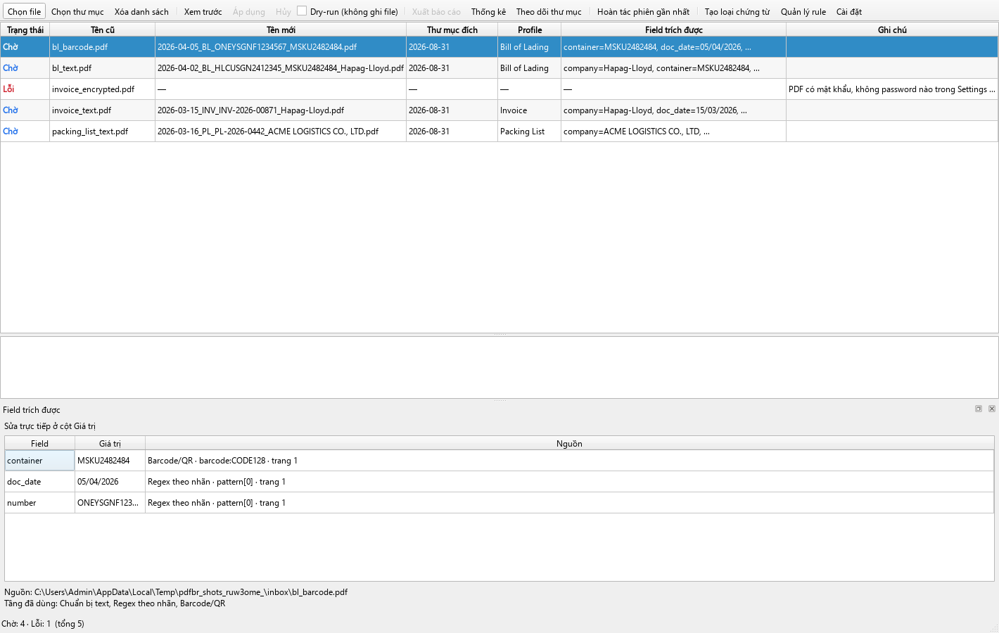

Sai thì bấm **Hoàn tác phiên gần nhất**. Muốn chạy thử mà không đụng file nào thì tick
**Dry-run** trước khi Xem trước.

Kết quả nằm trong thư mục output, chia theo ngày xử lý:

```
D:\DaDoiTen\
  2026-08-31\
    2026-03-15_INV_INV-2026-00871_Hapag-Lloyd.pdf
    2026-04-02_BL_HLCUSGN2412345_MSKU2482484_Hapag-Lloyd.pdf
  _Loi\
    invoice_encrypted.pdf
    invoice_encrypted.pdf.txt      <- ghi rõ lý do lỗi
```

**Không file nào bị bỏ sót âm thầm.** Mỗi file kết thúc ở đúng 1 trạng thái: Thành công,
Trùng, hoặc Lỗi (và file lỗi luôn được đưa vào `_Loi` kèm ghi chú lý do).

## Tạo rule cho loại chứng từ của bạn

Bấm **Tạo loại chứng từ…** trên thanh công cụ. Wizard 4 bước, không cần biết regex.

**Bước 1 — nạp 1 file mẫu.** App tự đọc text; nếu là bản scan thì tự OCR.

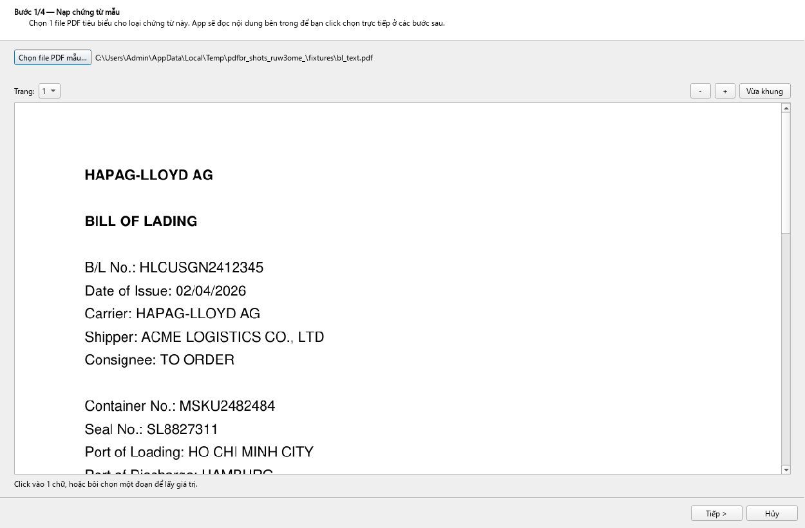

**Bước 2 — dạy app nhận ra loại chứng từ.** Click vào chữ đặc trưng trên trang (vd
`BILL OF LADING`) rồi bấm *Thêm điều kiện*.

Ô **LOẠI TRỪ** bên dưới dùng cho chứng từ chồng lấn: Packing List cũng có dòng
`Invoice No.`, nên profile Invoice nên loại trừ `PACKING LIST`. Điều kiện loại trừ có
quyền phủ quyết, không phụ thuộc thứ tự ưu tiên.

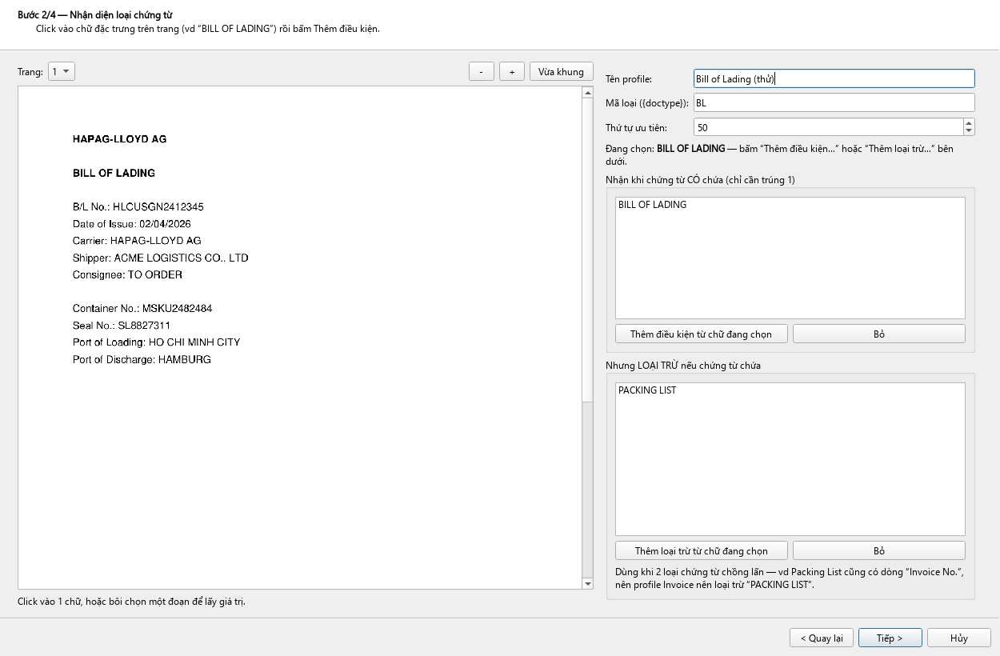

**Bước 3 — dạy app lấy dữ liệu.** Hai cách:

*Bôi chọn chữ* — app đề xuất 2–3 cách tìm, mỗi cách kèm một câu giải thích tiếng Việt, và
chạy thử ngay trên chính file mẫu:

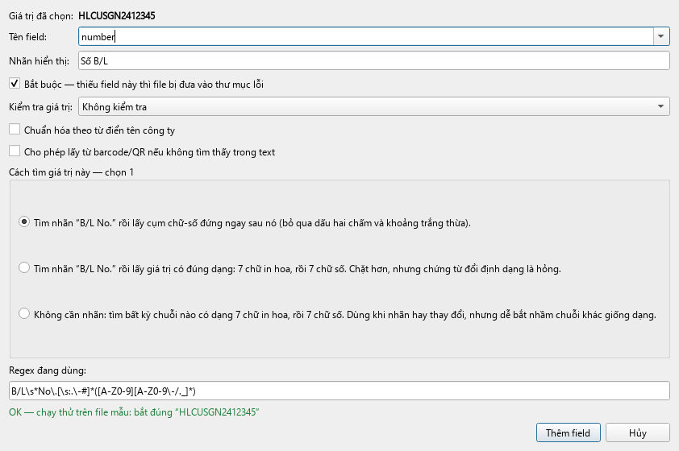

*Kéo khung vùng* — hợp với biểu mẫu in sẵn, nơi giá trị luôn nằm đúng một chỗ nhưng nhãn
thất thường, hoặc bản scan chữ nhận dạng không chuẩn:

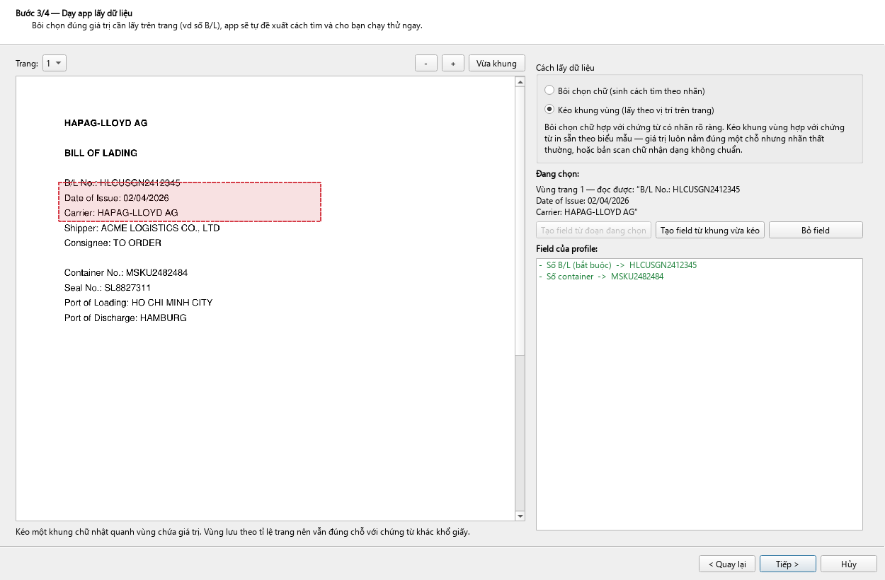

Vùng thường ôm nhiều giá trị, nên hộp thoại cảnh báo và cho lọc tiếp: lấy phần sau một
nhãn (kèm điểm dừng: tại nhãn kế tiếp / tại 2 khoảng trắng / theo biểu thức), lấy dòng thứ
N, hoặc lọc bằng biểu thức. Kết quả hiện ngay bên dưới:

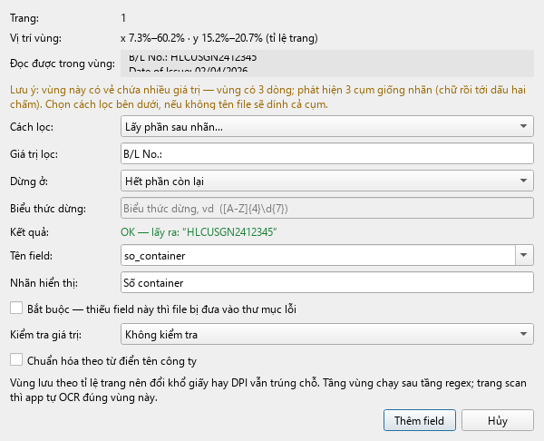

**Bước 4 — ghép tên file.** Bấm token để chèn, xem trước tên kết quả ngay. Token chưa có
field tương ứng bị làm mờ kèm nhãn *(chưa có field)*.

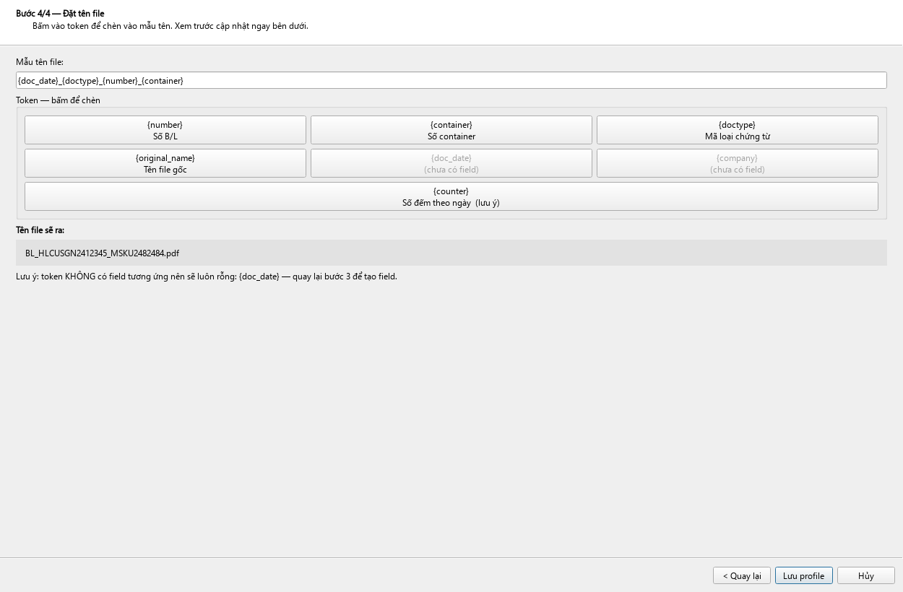

Token dùng được: `{doc_date}` `{number}` `{company}` `{doctype}` `{original_name}`
`{counter}` và mọi field bạn tự đặt tên. Ngày mặc định ghi `yyyy-MM-dd`, đổi được bằng
`{doc_date:ddMMyyyy}`. `{counter}` làm cùng một file chạy 2 lần ra 2 tên khác nhau, chỉ
nên dùng cho profile "Chung".

## Sửa rule đã có

**Quản lý rule…** trên thanh công cụ:

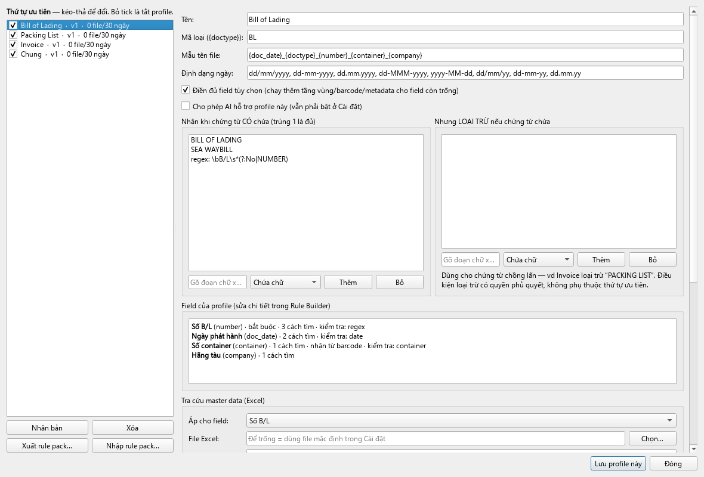

- Bật/tắt bằng ô tick; **kéo-thả để đổi thứ tự ưu tiên** (profile "Chung" luôn ở cuối).
- **Nhân bản** để thử biến thể — bản sao tắt sẵn, không tranh nhận chứng từ với bản gốc.
- **Thư viện file mẫu** (tối đa 5) và **lịch sử version**. Mỗi lần lưu tạo version mới và
  app tự chạy **regression test** trên bộ mẫu, báo rõ field nào match kém đi — chỉ lưu khi
  bạn xác nhận. **Rollback 1 click**, và rollback cũng tạo version mới nên lịch sử không mất.
- **Rule pack**: xuất toàn bộ rule ra 1 file JSON để backup hoặc mang sang máy khác.

## Tra cứu master data (Excel)

Trong Quản lý rule, nhóm *Tra cứu master data*: chọn field, chỉ file .xlsx, cột dò, cột lấy
ra, rồi đặt tên field mới. Ví dụ field `ma_kh` bắt được `KH001` → dò cột `Ma KH` → lấy
`Ten cong ty` → sinh field `ten_kh`, dùng ngay trong mẫu tên file bằng `{ten_kh}`.

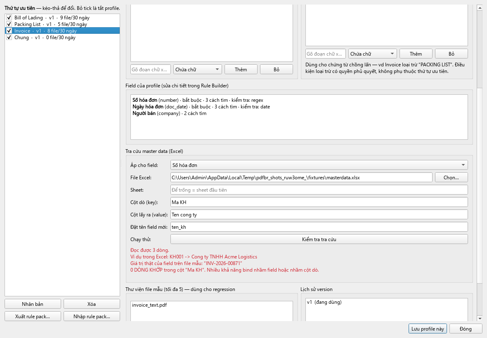

Nút **Kiểm tra tra cứu** không chỉ mở file: nó lấy **giá trị thật** của field từ file mẫu
rồi dò thử, nên bind nhầm field vào nhầm cột là báo *0 dòng khớp* ngay.

File Excel được nạp vào bộ nhớ ở đầu batch, cache theo thời điểm sửa file, mở read-only nên
không tranh chấp với Excel đang mở. File khóa hoặc thiếu chỉ sinh cảnh báo trong Preview,
**không làm hỏng cả batch**.

## App học từ chỉnh sửa của bạn

Sửa một field trong Preview → app hỏi *"Tạo rule từ chỉnh sửa này?"* → đề xuất cách tìm
(cả regex lẫn vùng) → chạy thử ngay trên chính file đó → bạn duyệt → app chạy regression
rồi mới ghi vào profile thành version mới.

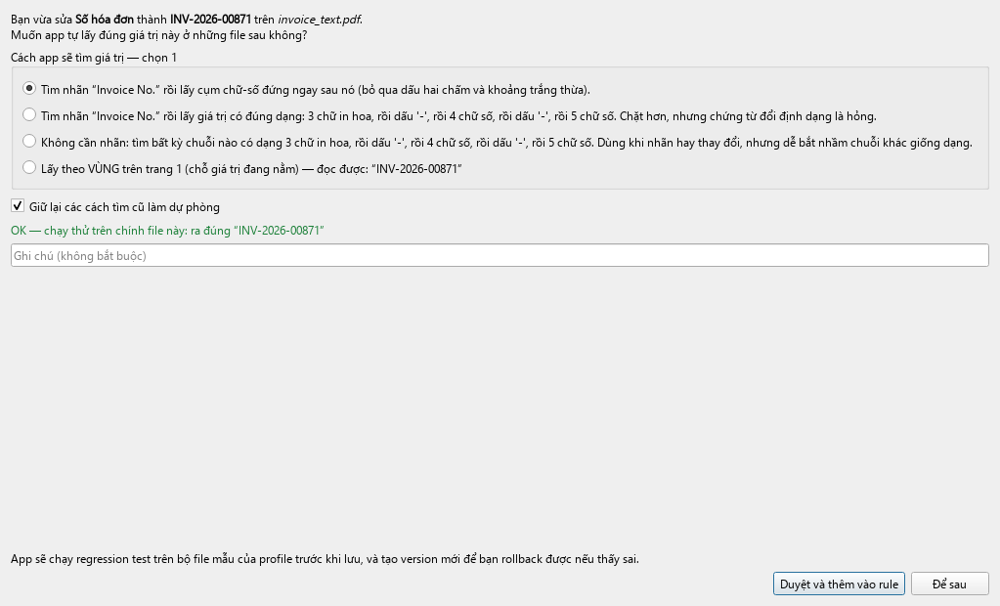

**App không bao giờ tự sửa rule.** Không có đường nào ghi vào profile mà không qua nút
duyệt của bạn.

## Thống kê và báo cáo

- **Xuất báo cáo…** sau mỗi batch: CSV (kèm BOM để Excel tiếng Việt không lỗi font) hoặc
  .xlsx, đủ tên cũ/mới, thư mục đích, profile, trạng thái, field, tầng pipeline, ghi chú.
- **Thống kê**: tỉ lệ match theo profile 7/30/90 ngày kèm nhận xét *Tốt / Cần để mắt /
  Nên chỉnh rule*, để biết rule nào đang yếu.

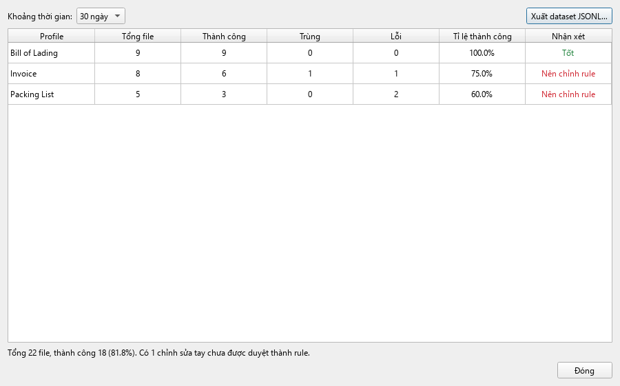

- **Theo dõi thư mục**: bật/tắt trên thanh công cụ. PDF mới rơi vào thư mục đã cấu hình sẽ
  được xử lý và ghi ra output luôn, không qua Preview; file lỗi vẫn vào `_Loi/`.

## Xử lý sự cố

**Kiểm tra nhanh tình trạng máy** — mở Command Prompt tại thư mục app:

```bash
pdf-renamer.exe --check
```

In ra: đang dùng `tesseract.exe` nào, thư mục `tessdata` nào, có sẵn gói ngôn ngữ gì,
barcode có chạy không, thư mục dữ liệu ở đâu. Gặp lỗi thì gửi nguyên output này.

**PDF scan không đọc được chữ (bản lite).** Bản lite không kèm OCR. Cài Tesseract:
`winget install UB-Mannheim.TesseractOCR`, rồi mở **Cài đặt → OCR & Barcode → Kiểm tra
Tesseract**. Thiếu gói tiếng Việt thì bấm **Cài gói ngôn ngữ còn thiếu** — app tự tải và
ghi vào thư mục riêng của nó, không cần quyền admin.

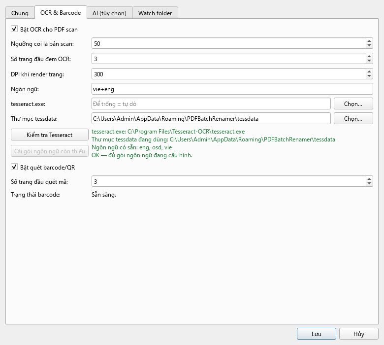

**Không quét được barcode/QR.** Thư viện `pyzbar` cần **Visual C++ Redistributable 2013
(x64)**. Thiếu nó thì app **không crash** — tầng barcode tự tắt và ghi cảnh báo vào log.
Tải tại <https://www.microsoft.com/en-us/download/details.aspx?id=40784>.

**PDF có mật khẩu.** Vào **Cài đặt → Chung → Mật khẩu PDF**, mỗi dòng một mật khẩu; app thử
lần lượt. Không mở được thì file vào `_Loi` với lý do `password-protected`.

**OCR chậm.** OCR chậm hơn đọc text hàng chục lần. Cách giảm:

- **Cài đặt → OCR**: giảm *Số trang đầu đem OCR* (mặc định 3) và *DPI* (300 → 200).
- Chỉ để `vie+eng` nếu thật sự cần cả hai; một ngôn ngữ chạy nhanh hơn.
- Tăng *Số luồng xử lý* nếu máy nhiều nhân.
- Chứng từ có sẵn text thì app không OCR — nếu vẫn OCR, kiểm tra *Ngưỡng coi là bản scan*
  (mặc định 50 ký tự).

**Nâng cấp lên bản mới.** Giải nén bản mới đè lên thư mục cũ (hoặc để chỗ khác) rồi chạy.
Toàn bộ cấu hình, rule, lịch sử version và registry chống trùng nằm trong
`%APPDATA%\PDFBatchRenamer\`, **không** nằm trong thư mục app, nên nâng cấp không mất gì.

## Dữ liệu app lưu ở đâu

`%APPDATA%\PDFBatchRenamer\`

```
config.json              cấu hình (KHÔNG chứa API key)
profiles\*.json          rule từng loại chứng từ
profiles\_versions\      lịch sử version để rollback
dictionaries\            từ điển chuẩn hóa tên công ty
tessdata\                gói ngôn ngữ OCR (không cần quyền admin)
sessions\                operation log từng phiên, dùng cho Hoàn tác
data.db                  registry chống trùng, provenance, dataset, thống kê
logs\app.log
```

API key của dịch vụ AI **chỉ** nằm trong Windows Credential Manager (qua `keyring`), không
bao giờ ghi vào `config.json` hay log.

---

# Phần 2 — Dòng lệnh và tự động hóa

```bash
pdf-renamer.exe --input "D:\ChungTu" --output "D:\DaDoiTen" --dry-run
pdf-renamer.exe --input "D:\ChungTu" --output "D:\DaDoiTen"
pdf-renamer.exe --input "D:\Inbox"   --output "D:\DaDoiTen" --watch
pdf-renamer.exe --check
```

| Tham số | Ý nghĩa |
|---|---|
| `--input`, `-i` | File hoặc thư mục (lặp lại được, thư mục quét đệ quy) |
| `--output`, `-o` | Ghi đè thư mục output cấu hình trong app |
| `--profile`, `-p` | Ép dùng 1 profile, bỏ qua điều kiện nhận diện |
| `--dry-run` | Chỉ xem trước |
| `--watch` | Theo dõi thư mục |
| `--no-dedup` | Bỏ qua kiểm tra file đã xử lý |
| `--workers N` | Số luồng song song |
| `--check` | In tình trạng môi trường rồi thoát |

**Exit code** (cho n8n / script ngoài): `0` = tất cả thành công, `1` = có file lỗi (đã cách
ly vào `output/_Loi/`), `2` = lỗi cấu hình.

---

# Phần 3 — Dành cho người phát triển

## Chạy từ mã nguồn

```bash
python -m venv .venv
.venv\Scripts\pip install -r requirements.txt
.venv\Scripts\python -m src.app
```

## Chạy test

```bash
.venv\Scripts\python -m pytest
```

Test OCR với Tesseract thật (tự bỏ qua nếu chưa cài):

```bash
.venv\Scripts\python -m pytest -m integration
```

Sinh lại file mẫu, chụp lại ảnh giao diện (offscreen):

```bash
.venv\Scripts\python tools/make_fixtures.py tests/fixtures/generated
.venv\Scripts\python tools/screenshots.py docs/screenshots
```

## Đóng gói

```bash
.venv\Scripts\python tools/build.py          # cả 2 bản
.venv\Scripts\python tools/build.py lite
```

Bản `full` lấy Tesseract từ máy đang cài, chỉ chép phần cần chạy (tesseract.exe + DLL +
tessdata `eng`/`vie`) vào `dist\PDFBatchRenamer-full\tesseract\`.

Kiểm tra đường nâng cấp trên thư mục dữ liệu giả lập "đã dùng lâu":

```bash
.venv\Scripts\python tools/upgrade_check.py dist/PDFBatchRenamer-full
```

## Rule mẫu đi kèm

`assets/profiles/` có sẵn 4 profile, tự nạp vào `%APPDATA%` ở lần chạy đầu:

| Profile | Nhận diện khi thấy | Tên file sinh ra |
|---|---|---|
| Bill of Lading | `BILL OF LADING`, `B/L No` | `{doc_date}_BL_{number}_{container}_{company}` |
| Packing List | `PACKING LIST` | `{doc_date}_PL_{number}_{company}` |
| Invoice | `COMMERCIAL INVOICE`, `INVOICE` | `{doc_date}_INV_{number}_{company}` |
| Chung (fallback) | — | giữ nguyên tên gốc |

Thứ tự ưu tiên: B/L (10) → Packing List (15) → Invoice (20) → Chung (999). Profile Invoice
khai báo **loại trừ** `PACKING LIST` và `BILL OF LADING`, nên chứng từ chồng lấn vào đúng
chỗ kể cả khi đổi thứ tự ưu tiên.

Định dạng ngày của profile nhận cả năm 2 chữ số (`dd/mm/yy`) vì chứng từ thật hay ghi
"17/7/26". Mốc thế kỷ: **yy ≤ 49 → 20xx**, còn lại → 19xx.

## Kiến trúc

Xem `CLAUDE.md`: pipeline 5 tầng, quy ước code, và toàn bộ quyết định thiết kế đã chốt.

## Giấy phép & phụ thuộc

Xem `requirements.txt`. Tesseract và zbar là phần mềm bên thứ ba với giấy phép riêng
(Apache 2.0 và LGPL); bản `full` phân phối kèm Tesseract.
